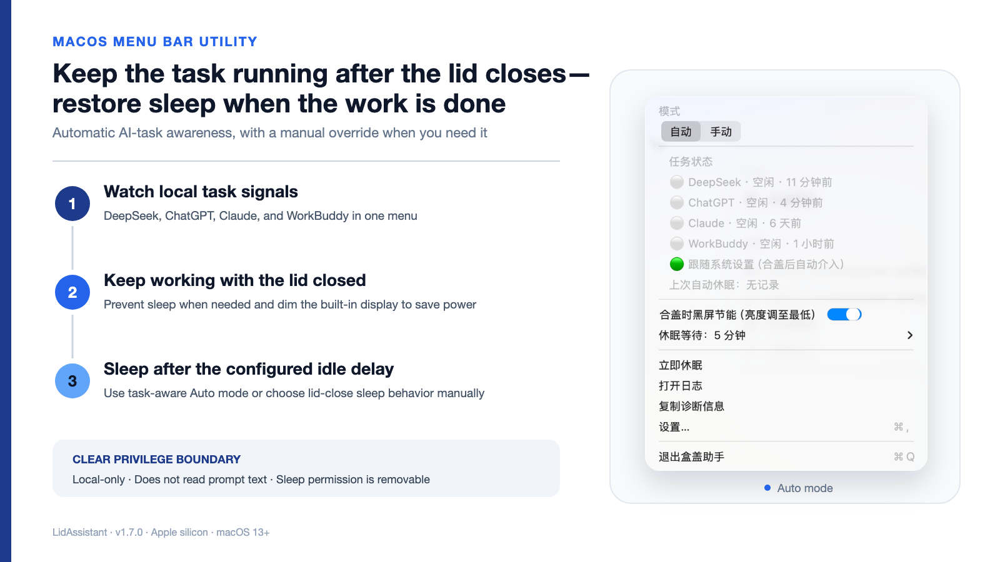
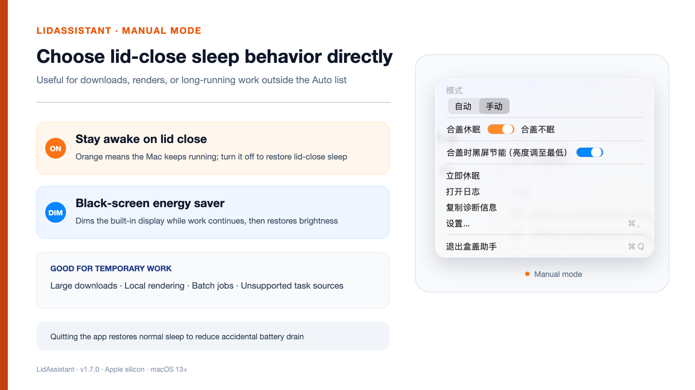

<p align="center">
  <b>English</b> &nbsp;·&nbsp; <a href="README.zh-CN.md">简体中文</a>
</p>

# LidAssistant (盒盖助手)

<p align="center">
  
</p>

<p align="center">
  A native macOS menu-bar utility that keeps selected AI work running with the lid closed, then restores normal sleep behavior when the work is done.
</p>

<p align="center">
  <a href="LICENSE"></a>
  
  
  
  <a href="https://github.com/yinshi1226-ai/LidAssistant/actions"></a>
  <a href="https://github.com/yinshi1226-ai/LidAssistant/releases"></a>
</p>

## Two modes, one clear boundary

- **Auto** watches supported local task signals. When the lid is closed, active work keeps the Mac awake; after activity ends, the app waits for the configured delay before requesting sleep.
- **Manual** lets you explicitly choose “sleep on lid close” or “stay awake on lid close.”
- **Black-screen energy saver** lowers the built-in display brightness while closed-lid work continues, then restores brightness after the lid opens.
- **External display guard** stops the app from intervening while an external display is connected.
- **Crash watchdog** restores normal lid-close sleep if the app stops unexpectedly.

## Interface

| Auto mode | Manual mode |
|---|---|
|  |  |

<p align="center">
  
</p>

## Task signals

LidAssistant inspects local status and recent activity; it does not read or upload prompt text.

| Service | Signal used |
|---|---|
| DeepSeek Harness | Local session API and its `running` field |
| ChatGPT / Codex | Recent local session events and completion markers |
| Claude | Recent local project events and end-of-turn markers |
| WorkBuddy | Recent local project-log activity |

Per-process network activity may extend an active state briefly, but does not create a task on its own.

## Install

### Homebrew

```bash
brew install --cask yinshi1226-ai/tap/lidassistant
/Applications/盒盖助手.app/Contents/Resources/grant.sh
```

The second command is a one-time authorization step. It installs a tightly scoped sudoers rule, the crash watchdog, and launch-at-login support.

### Download a release

1. Download `LidAssistant.zip` from the [latest release](https://github.com/yinshi1226-ai/LidAssistant/releases/latest).
2. Unzip the app into `/Applications`.
3. Run `/Applications/盒盖助手.app/Contents/Resources/grant.sh` once.

The release is ad-hoc signed. On first launch, macOS may ask you to confirm it in **System Settings → Privacy & Security**.

### Build from source

```bash
git clone https://github.com/yinshi1226-ai/LidAssistant.git
cd LidAssistant
./install.sh
```

## Permissions and privacy

- No telemetry and no advertising SDK.
- The sudoers rule allows only `pmset -a disablesleep 0` and `pmset -a disablesleep 1`.
- Task detection uses timestamps, status fields, and event markers—not prompt content.
- Local diagnostic logs remain on the Mac.
- Authorization and installed support files can be removed with `./uninstall.sh`.

See [SECURITY.md](SECURITY.md) for the exact files and privilege boundary.

## Notes

- Other macOS sleep assertions—such as video calls or media playback—can still delay sleep.
- Non-Harness task detection is based on recent local events and may need tuning if an upstream app changes its log format.
- LidAssistant is intended for Apple silicon Macs running macOS 13 or later.

## Development

```bash
cd LidAssistant
swift test
swift run LidAssistant --dry-run
./build-app.sh
```

## License

[MIT](LICENSE)
