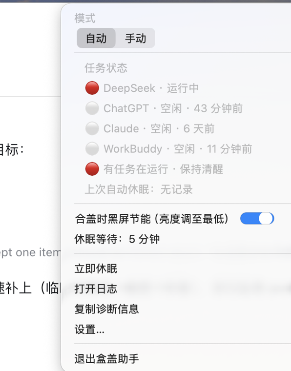

<p align="center">
  <a href="README.md">English</a> &nbsp;·&nbsp;
  <b>简体中文</b>
</p>

<p align="center">
  <picture>
    <source media="(prefers-color-scheme: dark)" srcset="assets/menu-dark.png">
    <source media="(prefers-color-scheme: light)" srcset="assets/menu-light.png">
    
  </picture>
</p>

<p align="center">
  <b>盒盖助手（LidAssistant）</b><br>
  <sub>macOS 菜单栏应用：合盖时是否休眠，由你说了算；AI 任务运行时，合盖也能继续跑。</sub>
</p>

<p align="center">
  <a href="LICENSE"></a>
  
  
  
  <a href="https://github.com/yinshi1226-ai/LidAssistant/actions"></a>
  <a href="https://github.com/yinshi1226-ai/LidAssistant/releases"></a>
</p>

> [!NOTE]
> 合盖即休眠是 macOS 的默认行为，`caffeinate` 类工具（如 KeepingYouAwake）**无法**阻止它。要让合盖后电脑继续运行，唯一可靠的开关是 `pmset disablesleep`（内核的 `SleepDisabled` 标志）。本项目就是围绕这一个开关，加上「AI 任务感知」与多层安全保护。

## 它能做什么

| | | |
|---|---|---|
| 🔀 | **两种模式** | 自动（任务感知）/ 手动（合盖休眠 ⇄ 合盖不眠），菜单顶部一段切换 |
| 🤖 | **AI 任务感知** | 合盖时任务运行 → 保持清醒；任务全部结束 → 按设定时间（默认 1 分钟）自动休眠 |
| 🎯 | **判定准确** | 直接读各软件自带的权威状态源，而非猜测 CPU/标题 |
| 🌑 | **合盖黑屏节能** | 保持运行期间把内置屏亮度调到最低（显示器不休眠），开盖瞬间恢复 |
| 🖥️ | **外接屏自动停用** | 检测到外接显示器时程序自动停用、完全跟随系统，拔掉后自动恢复 |
| 🛡️ | **安全设计** | sudoers 仅两条命令、崩溃看门狗防电池耗尽、零遥测 |
| 🚀 | **开机自启** | 登录后自动运行，随时监控任务 |

## 判定原理（为什么准）

不是「猜」，而是**读各软件自带的权威状态源**：

| 服务 | 判定方式 |
|---|---|
| DeepSeek（DeepSeek Harness） | 调用本机 DSH API `POST /api/session.list`，读取官方 `running` 字段（零猜测） |
| ChatGPT（桌面版 Codex 引擎） | 扫描 `~/.codex/sessions/**` 任务日志：只在任务执行时写入，尾部出现 `task_complete` 即结束 |
| Claude（Claude Code / 桌面版） | 扫描 `~/.claude/projects/**` 任务日志：尾部出现 `last-prompt` 即本轮结束 |
| WorkBuddy | 扫描 `~/.workbuddy/projects/**` 任务日志：流式输出时持续写入，空闲即停 |

另有进程网络流量佐证（只延长活跃判定，不单独误报），以及防误判门控。

## 与同类工具对比

| | **盒盖助手** | Sleepless | Amphetamine | KeepingYouAwake | `caffeinate` |
|---|:---:|:---:|:---:|:---:|:---:|
| 合盖不休眠（无需外接屏） | ✅ | ✅ | ⚠️ ¹ | ❌ ² | ❌ |
| AI 任务感知自动休眠 | ✅ | ❌ | ❌ | ❌ | ❌ |
| 合盖黑屏节能 | ✅ | ❌ | ⚠️ | ❌ | ❌ |
| 外接屏自动停用 | ✅ | ❌ | ❌ | ❌ | ❌ |
| 开源 | ✅ MIT | ✅ MIT | ❌ 闭源 | ✅ MIT | Apple |

<sub>¹ Amphetamine 的 closed-display 模式在 Apple Silicon 上可靠性有争议；² KeepingYouAwake 本质是 `caffeinate`，合盖即睡是其设计边界。</sub>

## 安装

### 方式一：Homebrew（推荐）

```bash
brew install --cask yinshi1226-ai/tap/lidassistant
/Applications/盒盖助手.app/Contents/Resources/grant.sh   # 一次性授权（弹一次开机密码）
```

### 方式二：下载 Release

从 [最新 Release](https://github.com/yinshi1226-ai/LidAssistant/releases/latest) 下载 zip，解压到 `/Applications`，然后运行 `/Applications/盒盖助手.app/Contents/Resources/grant.sh`。

### 方式三：源码安装

```bash
git clone https://github.com/yinshi1226-ai/LidAssistant.git
cd LidAssistant
./install.sh
```

> [!NOTE]
> 当前构建为 ad-hoc 签名，首次安装需在「系统设置 → 隐私与安全性」中允许打开（源码方式安装不会出现该提示）。
>
> `grant.sh` 是一次性授权：安装 `pmset -a disablesleep 0/1` 两条命令的免密 sudoers + 崩溃看门狗 + 登录自启。详见 [SECURITY.md](SECURITY.md)。

## 使用

菜单栏点击**彩色圆点**图标：

- **图标颜色**：🟢 绿 = 空闲/正常；🟠 橙 = 手动合盖不眠；🔴 红 = 任务运行中；⚪ 灰 = 外接屏停用。悬停有文字说明。
- **模式**：「模式：自动 | 手动」分段开关。
  - 自动：任务状态列表 + 状态行 + 上次自动休眠时间；完整逻辑只在**合盖**时生效，开盖完全跟随系统；
  - 手动：`合盖休眠 ⇄ 合盖不眠` 滑动开关，开关颜色与状态栏圆点一致。
- **合盖时黑屏节能**：滑动开关（打开为蓝色），合盖保持运行期间内置屏亮度调至最低，开盖自动恢复。
- **休眠等待**：子菜单直接选择「无动态 N 分钟后进入休眠」（30 秒 ~ 60 分钟，可自定义小数分钟）。

## 安全与隐私

详见 [SECURITY.md](SECURITY.md)。要点：

- **零遥测**：不向任何服务器上报数据；
- **最小权限**：sudoers 仅 `pmset -a disablesleep 0/1` 两条命令；
- **不读私密内容**：只读任务状态文件的时间戳与事件类型，不上传不外发；
- **崩溃保护**：看门狗 2 分钟内自动恢复允许休眠；
- **外接屏自动停用**：有外接显示器时不干预系统。

## 常见问题

- **合盖后没立即睡**：自动模式有设定宽限（默认 1 分钟），这是特性；想立即睡请用「手动：合盖休眠」。
- **任务跑完了没在 N 分钟后睡**：看菜单状态行，大概率是「有外部程序占用」（视频/通话等）。
- **退出后合盖不休眠失效**：退出时会自动恢复允许休眠，防止忘关耗尽电池（保持运行即可，已配置开机自启）。

## 开发

```bash
cd LidAssistant
swift build                          # 编译
swift run LidAssistant --dry-run     # 试跑：只监控记录，不真的动 pmset/休眠
./build-app.sh                       # 打包 .app
```

## 卸载

```bash
cd <项目目录>
./uninstall.sh
```

## 许可

[MIT](LICENSE) © 2026 LidAssistant contributors
