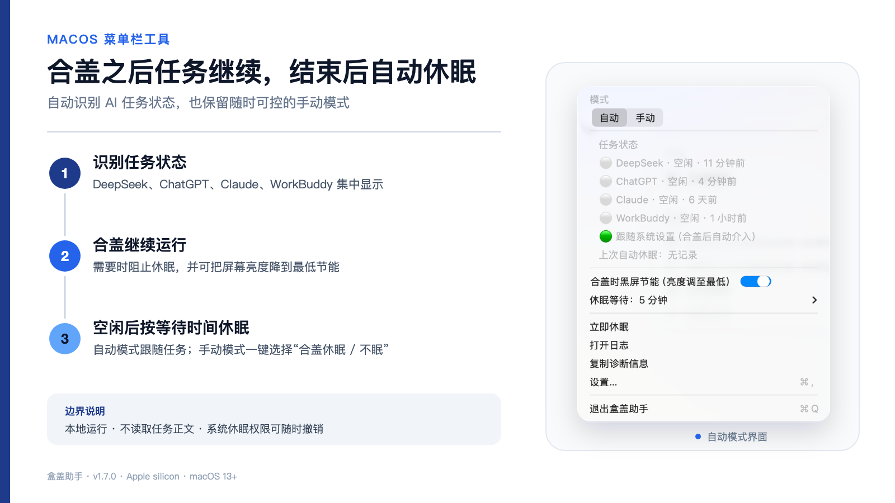
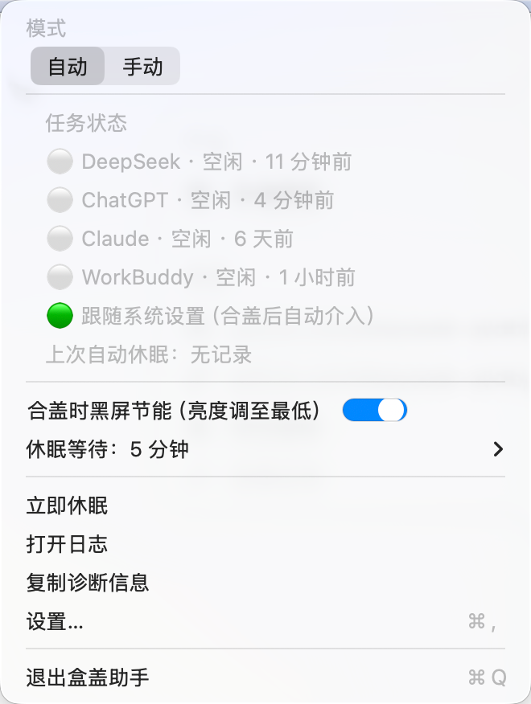
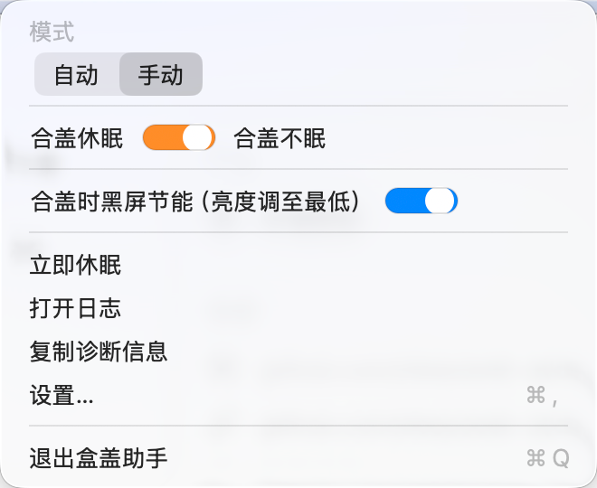
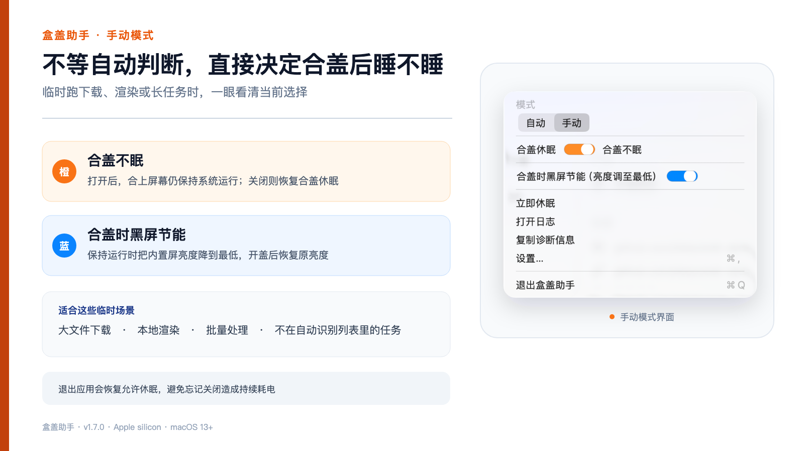

<p align="center">
  <a href="README.md">English</a> &nbsp;·&nbsp; <b>简体中文</b>
</p>

# 盒盖助手（LidAssistant）

<p align="center">
  
</p>

<p align="center">
  一个原生 macOS 菜单栏工具：合盖后让指定 AI 任务继续运行，任务结束后再恢复正常休眠。
</p>

<p align="center">
  <a href="LICENSE"></a>
  
  
  
  <a href="https://github.com/yinshi1226-ai/LidAssistant/actions"></a>
  <a href="https://github.com/yinshi1226-ai/LidAssistant/releases"></a>
</p>

## 两种模式，边界清楚

- **自动模式**：观察支持的软件在本机留下的任务状态。合盖后有任务就保持运行，任务结束后按设定时间请求休眠。
- **手动模式**：直接选择“合盖休眠”或“合盖不眠”，适合下载、渲染和批处理等临时任务。
- **黑屏节能**：合盖保持运行时把内置屏亮度降到最低，开盖后恢复。
- **外接屏保护**：检测到外接显示器时停止干预系统休眠。
- **崩溃看门狗**：应用异常退出后恢复允许休眠，减少忘记关闭造成的耗电。

## 界面

| 自动模式 | 手动模式 |
|---|---|
|  |  |

<p align="center">
  
</p>

## 任务状态从哪里来

盒盖助手只观察本机状态和近期活动，不读取或上传提示词正文。

| 服务 | 使用的本地信号 |
|---|---|
| DeepSeek Harness | 本机会话 API 与 `running` 字段 |
| ChatGPT / Codex | 近期会话事件和完成标记 |
| Claude | 近期项目事件和本轮结束标记 |
| WorkBuddy | 近期项目日志活动 |

进程网络活动只会短暂延长“活跃”状态，不会单独创建一个任务。

## 安装

### Homebrew

```bash
brew install --cask yinshi1226-ai/tap/lidassistant
/Applications/盒盖助手.app/Contents/Resources/grant.sh
```

第二条命令只需执行一次：安装严格限定的 sudoers 规则、崩溃看门狗和登录自启。

### 下载 Release

1. 从 [最新 Release](https://github.com/yinshi1226-ai/LidAssistant/releases/latest) 下载 `LidAssistant.zip`。
2. 解压后把 App 放入 `/Applications`。
3. 执行 `/Applications/盒盖助手.app/Contents/Resources/grant.sh` 完成一次性授权。

Release 采用 ad-hoc 签名。首次打开时，macOS 可能要求你在“系统设置 → 隐私与安全性”中确认。

### 源码安装

```bash
git clone https://github.com/yinshi1226-ai/LidAssistant.git
cd LidAssistant
./install.sh
```

## 权限与隐私

- 没有遥测，也没有广告 SDK。
- sudoers 只允许 `pmset -a disablesleep 0` 和 `pmset -a disablesleep 1`。
- 任务判断使用时间戳、状态字段和事件标记，不读取提示词正文。
- 诊断日志只保留在本机。
- 可以通过 `./uninstall.sh` 撤销授权并移除支持文件。

详细文件与权限边界见 [SECURITY.md](SECURITY.md)。

## 使用说明

- 菜单栏圆点：绿色为空闲，橙色为手动合盖不眠，红色为任务运行，灰色为外接屏停用。
- 自动模式只在合盖时介入；开盖时跟随系统。
- 手动模式的橙色开关决定合盖是否休眠，蓝色开关决定是否把屏幕亮度降到最低。
- 视频通话、媒体播放等其他 macOS 休眠断言仍可能延迟最终休眠。
- 非 Harness 软件依赖本地日志格式，上游软件变更后可能需要调整识别规则。

## 开发与验证

```bash
cd LidAssistant
swift test
swift run LidAssistant --dry-run
./build-app.sh
```

## 许可

[MIT](LICENSE)
